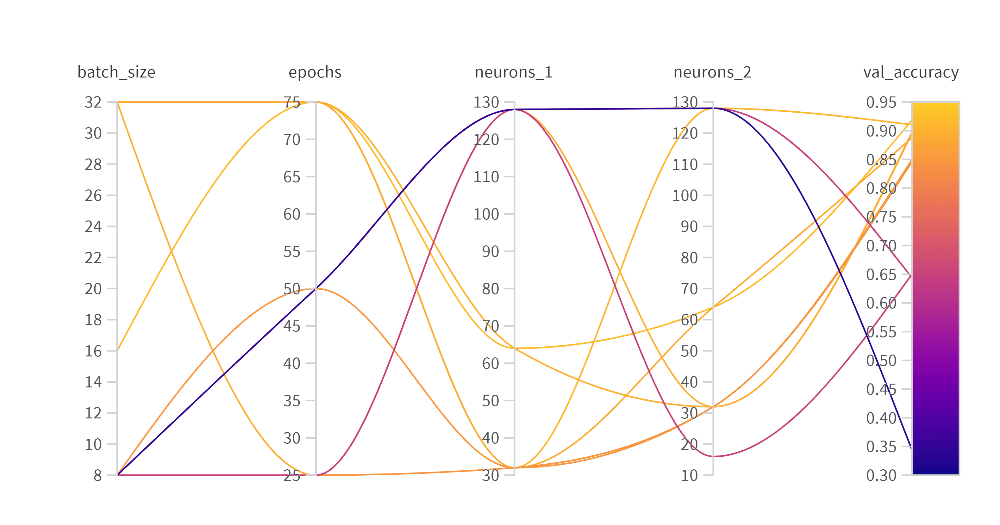
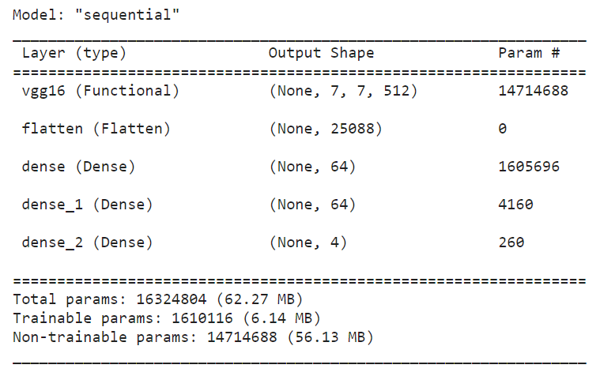

# Acknolodgement:
This work was done during my internship at the Research Center for Scientific and Technical Information (CERIST), Algiers, Algeria. I was fortunate enough to work with talentend and amazing researchers there whom i learned a lot of valuable knowledge from. So I would like to take a moment to thank all the researcehrs working in CERIST, and in the STI deparetemnt.

# Licence-Plate-Detection-CNN

## Introduction 

License plate detection & recognition is an important and popular research issue in image
processing and computer vision. Applications based on license plate detection are playing an
increasingly important role in our daily life, such as unattended parking lots, security control of
restricted areas, congestion pricing, and automatic toll collection

## Data Exploration
- The dataset contains over 28.8k images of vehicules, however not all images are useful to train
our model(some are low resolution...etc) and to avoid computational overload, we will chose a random
number of .jpg images around(1500-2000) and put them on a separate folder.
Then we will append our images to an array X, after resizing them to an standard 200×200 pixels
size, while also apending the annotations to our y array

- The annotations come in a separate .json file that contain all informations about the images(name, annotations, license plate...etc)
, code in the nootebook shows how to extract them.

- Transform the images to an Ndarray, and normalize them (divide by 255)

## Splitting Data (Train/Test)

In this step we will split the data into train, validation and test set. The train and validation sets will be used when training the model (and validating). While the test set will be used to evaluate the model.

## Hyperparams tuning:

## Setting up/Building the model

For this application we'll be using a CNN model with VGG16 pre-trained weights for image detection and some dense layers for classification of the output (see summary below).

## Training and Evaluation
Now that we have created the model, and checked it’s summary. It’s time to get to the
important part of this project, the trainning of the model. The time required for training depends
on many facteurs including data size, equipment(CPU, GPU ..) etc.
The accuracy by epochs graph can be seen below.

